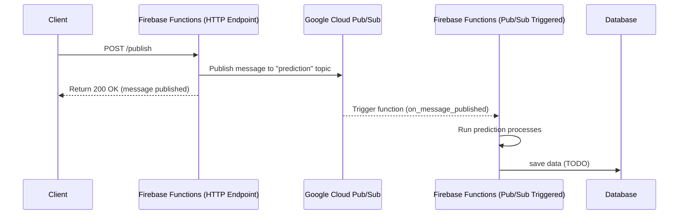

# Sequence Diagram - Start Prediction

```mermaid
sequenceDiagram
    participant Client as Client
    participant API_HTTP as Firebase Functions (HTTP Endpoint)
    participant PubSub as Google Cloud Pub/Sub
    participant API_PubSub as Firebase Functions (Pub/Sub Triggered)
    participant DB as Database

    Client->>API_HTTP: POST /publish
    API_HTTP->>PubSub: Publish message to "prediction" topic
    API_HTTP-->>Client: Return 200 OK (message published)
    PubSub-->>API_PubSub: Trigger function (on_message_published)
	API_PubSub->>API_PubSub: Run prediction processes
    API_PubSub->>DB: save data (TODO)
```